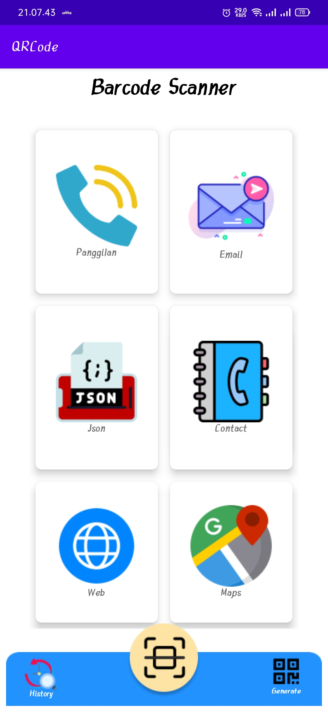
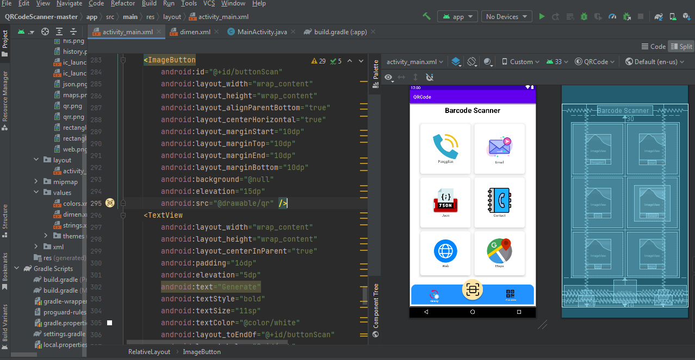
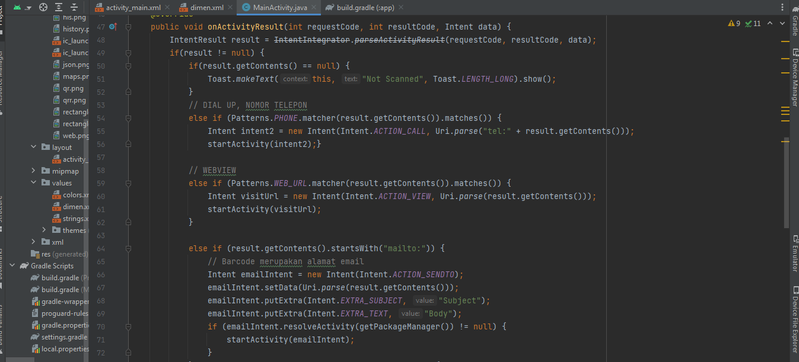

# QrCode Scanner
<h1>Aplikasi sederhana untuk QR scanner Barcode</h1> 
<h2>Fungsi QR aplikasi antara lain</h2> 
<h2> 1. untuk menampilkan JSON  
2. untuk menampilkan web view 
3. untuk melakukan panggilan 
4. untuk melakukan kirim email 
5. untuk menampilkan map</h2> 
<h1>1. Tampilan aplikasi pada handphone</h1> 

<h1>2. Tampilan code pada activity_main.xml</h1>

<h1>3. Tampilan code pada MainActivity.java</h1>

